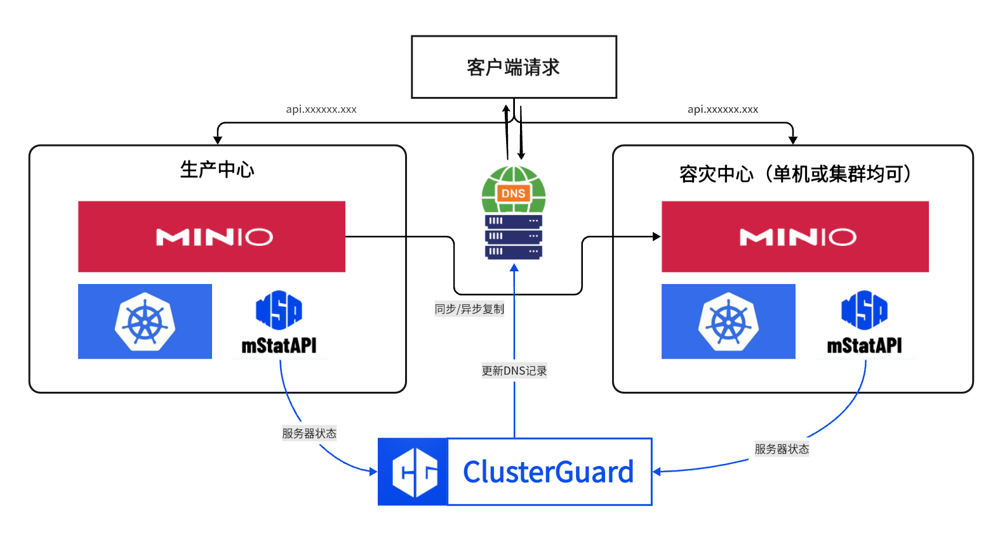

# ClusterGuard
 </br>
ClusterGuard 是一个用于集群监控和自动故障转移的Streamlit面板应用，旨在确保服务器集群的高可用性和稳定性。通过实时监控节点状态和热备机制，ClusterGuard 可以在节点失效时触发预定义规则，提供直观的状态反馈和日志记录。需要集成 mStatAPI，用于获取 CPU 负载、内存使用和网络延迟等关键指标，准确及时监控。

## 功能

- 实时监控服务器健康状态。
- 自动故障转移，支持自定义重试机制。
- 直观的界面和状态反馈。


## 自动规则


## 手动转移


## mStatAPI

[Mini Server Status API (mStatAPI)](https://github.com/mcxiaoxiao/mStatAPI) 是一个轻量级的服务器状态 API 工具，设计用于快速部署和监控服务器健康。它提供 CPU 负载、内存使用和网络延迟等基本指标，适合小规模服务器监控和管理任务。

## 安装步骤

1. **克隆仓库：**

   ```bash
   git clone https://github.com/mcxiaoxiao/ClusterGuard.git
   cd ClusterGuard
   ```

2. **安装所需软件包：**

   请确保已安装 Python，然后运行：

   ```bash
   pip install streamlit
   ```

3. **配置 DNS 接口：**

   编辑 `monitor.py` 以设置节点和热备服务 IP 的 DNS 接口，以 `west.cn` 为例。

4. **启动面板：**

   使用以下命令启动 Streamlit 应用：

   ```bash
   streamlit run monitor.py
   ```

## 文件结构

- **mStatAPI/**: 包含服务器状态监控的 API。
- **dns_control.py**: 处理 DNS 操作。
- **getstat.py**: 获取服务器统计信息。
- **LICENSE**: 许可证信息。
- **monitor.py**: 监控和故障转移逻辑的主脚本。
- **README.md**: 项目文档。

## 案例

在生产/灾备集群中安装mStatAPI并用ClusterGuard实现监控和自动故障转移：



